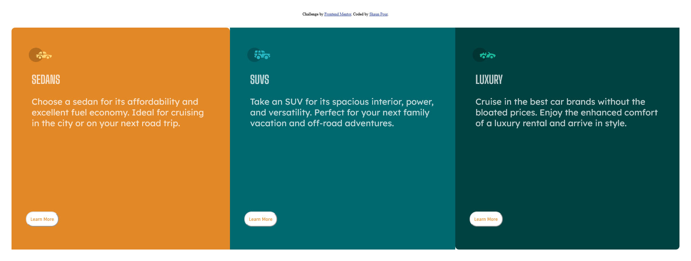

# Frontend Mentor - 3-column preview card component solution

This is a solution to the [3-column preview card component challenge on Frontend Mentor](https://www.frontendmentor.io/challenges/3column-preview-card-component-pH92eAR2-). Frontend Mentor challenges help you improve your coding skills by building realistic projects. 

## Table of contents

- [Overview](#overview)
  - [The challenge](#the-challenge)
  - [Screenshot](#screenshot)
  - [Links](#links)
- [My process](#my-process)
  - [Built with](#built-with)
  - [What I learned](#what-i-learned)
  - [Continued development](#continued-development)
  - [Useful resources](#useful-resources)
- [Author](#author)
- [Acknowledgments](#acknowledgments)

**Note: Delete this note and update the table of contents based on what sections you keep.**

## Overview

### The challenge

Users should be able to:

- View the optimal layout depending on their device's screen size
- See hover states for interactive elements

### Screenshot

### Links

- Solution URL: [https://github.com/DarkPhoenixNinja92/3-Column-Preview-Card-Component](https://github.com)
- Live Site URL: [https://darkphoenixninja92.github.io/3-Column-Preview-Card-Component/](https://darkphoenixninja92.github.io)

## My process

### Built with

- Semantic HTML5 markup
- SCSS custom properties
- Flexbox

### What I learned

I primarily learned how to be more consistent with using flexbox, making better use of those properties and how to make use of border radius (I'd used it before but only on occasion and this was the first time I had used it semi-extensively).

### Continued development

In the future, I want to work on being more able to recognize when to use flexbox over positioning with directional modifications (left, right, up, down) as I currently just kind of ballpark it with this sort of thing.

### Useful resources

- [W3Schools](http://www.w3schools.com/)
- [MDN](developer.mozilla.org)

## Author

- Website - [Shaun Pour](https://shaunpourdev.com)
- Frontend Mentor - [@darkphoenixninja92](https://www.frontendmentor.io/profile/DarkPhoenixNinja92)
- GitHub - [@darkphoenixninja92](https://github.com/DarkPhoenixNinja92)